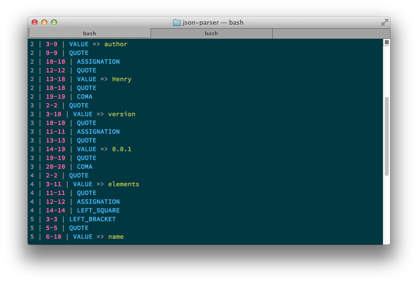

# json-parser 0.0.1

A simple json parser written in C

Only the lexer works right now.



## Compile

Simply execute the makefile by executing `make`, then you can execute the `build` file.
For now, the script is only reading a file called `example.json` at the root.

## Example

### Input

A classic json

```javascript
{
	"name": "Once upon a time",
	"author": "Henry",
	"version": "0.0.1",
	"elements": [
		{ "name": "cover" },
		{ "name": "pages" }
	]
}
```

### Output

A list of tokens with the structure:

* for single character elements:

	**line**, **column** | **content**
	
* for mutli characters elements

	**line**, **start**-**end** | **content**
	
For our example, we have:

| line | column | content            |
| ---- | ------ | ------------------ |
| 0    | 0      | LEFT_BRACKET       |
| 1    | 2      | QUOTE              |
| 1    | 3-6    | `name`             |
| 1    | 7      | QUOTE              |
| 1    | 8      | ASSIGNATION        |
| 1    | 10     | QUOTE              |
| 1    | 11-38  | `Once upon a time` |
| 1    | 39     | QUOTE              |
| 1    | 40     | COMMA              |
| 2    | 2      | QUOTE              |
| 2    | 3-8    | `author`           |
| 2    | 9      | QUOTE              |
| 2    | 10     | ASSIGNATION        |
| 2    | 12     | QUOTE              |
| 2    | 13-18  | `Henry`            |
| 2    | 19     | QUOTE              |
| 2    | 20     | COMMA              |
| 3    | 2      | QUOTE              |
| 3    | 3-9    | `version`          |
| 3    | 10     | QUOTE              |
| 3    | 11     | ASSIGNATION        |
| 3    | 13     | QUOTE              |
| 3    | 14-18  | `0.0.1`            |
| 3    | 19     | QUOTE              |
| 3    | 20     | COMMA              |
| 4    | 2      | QUOTE              |
| 4    | 3-10   | `elements`         |
| 4    | 11     | QUOTE              |
| 4    | 12     | ASSIGNATION        |
| 4    | 14     | LEFT_SQUARE        |
| 5    | 3      | LEFT_BRACKET       |
| 6    | 4      | QUOTE              |
| 6    | 5-8    | `name`             |
| 6    | 9      | QUOTE              |
| 6    | 10     | ASSIGNATION        |
| 6    | 12     | QUOTE              |
| 6    | 13-17  | `cover`            |
| 6    | 18     | QUOTE              |
| 7    | 3      | RIGHT_BRACKET      |
| 7    | 4      | COMMA              |
| 8    | 3      | LEFT_BRACKET       |
| 9    | 4      | QUOTE              |
| 9    | 5-8    | `name`             |
| 9    | 9      | QUOTE              |
| 9    | 10     | ASSIGNATION        |
| 9    | 12     | QUOTE              |
| 9    | 13-17  | `pages`            |
| 9    | 18     | QUOTE              |
| 10   | 3      | RIGHT_BRACKET      |
| 10   | 2      | RIGHT_SQUARE       |
| 10   | 1      | RIGHT_BRACKET      |